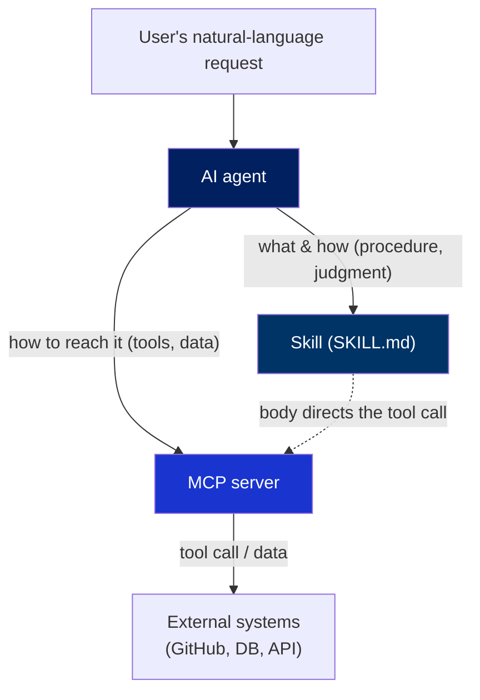
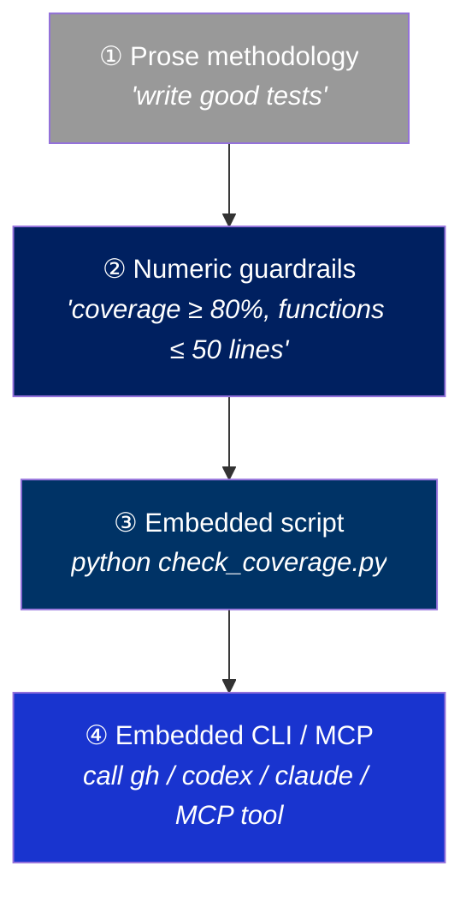
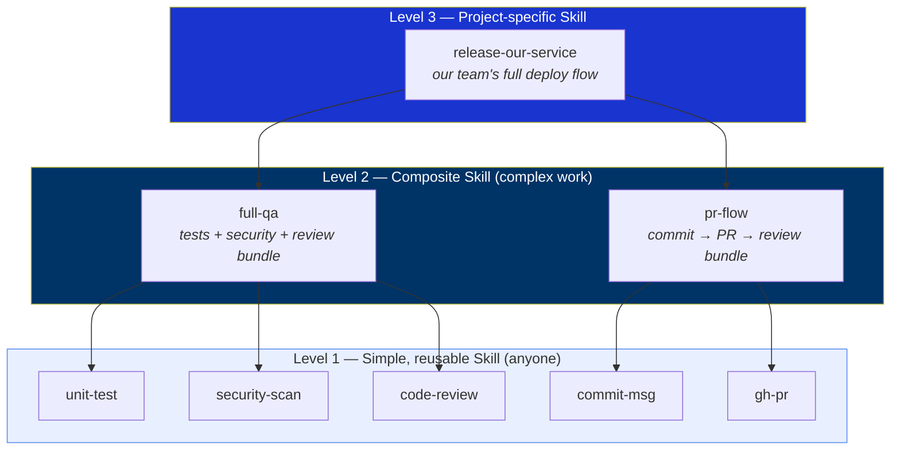

# Skills Are Strongest When They're Small and Explicit — On Designing Reusable Skills

> A set of principles I've put together while building with AI coding agents, on *what makes a skill work versus a skill that just sits there*.

When you develop with AI agents, at some point you realize something: you keep copy-pasting the same know-how to the model.

"Our API authenticates like this," "follow this commit-message convention," "use this library this way"… Re-explaining all of that every session is the height of inefficiency. So we started writing it down once and reusing it — and that format is the **Skill**.

But once you actually start making skills, the gap between a *skill that works well* and a *skill that merely exists* turns out to be quite large. This article is about that gap.

Let me state my conclusion up front: **a single skill should be small, do exactly one thing, and be extremely explicit. And you handle complex work by *composing* those small skills.**

---

## 1. What Is a Skill?

A quick definition before we dig in. A *Skill* is a small standard that's taking hold in the AI coding agent ecosystem.

A single markdown file called `SKILL.md` holds a `name`, a `description`, and a body containing procedures and know-how the agent can read. Most agentic tools (Claude Code / Cursor / Codex / Cline / Gemini CLI, etc.) look at the user's natural-language request and *automatically* pull the matching SKILL.md into their context.

Put simply, it's like a *plugin* that spoon-feeds the agent whatever know-how it needs, when it needs it. The key is that it's **thin**. Because the format is so simple (`name`, `description`, body), the same single SKILL.md behaves identically across many different tools.

```markdown
---
name: commit-msg
description: Write commit messages in Conventional Commits format.
  Use when "commit" or "commit message" is mentioned, or when creating a git commit.
---

# Commit Message

## Format
<type>: <description>   # type ∈ feat|fix|docs|refactor|test|chore
- Subject under 50 chars, wrap body at 72
- ...
```

That's all there is to it. But how you design *on top of* that simplicity is what separates good from bad.

---

## 2. Skills and MCP Don't Compete — They're Different Layers

The most common question I get is this: *"If we have MCP, why do we need Skills? Or vice versa?"*

They're not competitors. **They're different layers.**

- **MCP (Model Context Protocol)** is *how the agent talks to the outside world*. It's the *plumbing* for calling tools, fetching data, and accessing systems. It standardizes "how do I call this GitHub API," "how do I query this DB."
- **A Skill** is the *procedure and judgment for what to do, when, and how*. It's the *methodology*: "when doing this task, first check A, follow convention B, then verify with C."

By analogy, MCP is the *hands and feet*, and a Skill is the *work order*. No matter how good the hands and feet are, they spin uselessly without a sense of what to do in what order. Conversely, a perfect work order accomplishes nothing without hands and feet to execute it.



So **the most powerful combination is a Skill that *drives* MCP.** If the SKILL.md body says "at this step, call this MCP tool," procedure (skill) and execution (mcp) lock together. The Skill knows the *when and why*; MCP knows *how to reach it*.

For what it's worth, not every skill needs MCP. A skill carrying pure knowledge — "follow this convention" — is plenty useful on its own. MCP is something you pull in *when you need to reach the outside*, not a prerequisite.

### Aside — the "MCP is dead, long live the CLI" debate

In early 2026 a post titled *"MCP is dead, long live the CLI"* made the rounds, and a debate broke out over whether MCP was overhyped. My position is simple.

**When you need to register a tool on the Web, MCP is genuinely necessary** — there's still no other standard to fill that slot. **But if you're running locally, MCP is just more cumbersome than a skill that wraps a CLI or API well.** A running server process, schema declared up front, MCP-specific debugging… none of that beats simply calling `gh` or `jq` — which the LLM already knows well — from inside the skill body. Honestly, local MCP feels closer to something built to follow a trend.

And either way, **what really matters is designing the underlying API well.** If the API is clean, it works whether you wrap it with a CLI or with MCP; if the API is a mess, no wrapper saves it. The packaging (CLI vs MCP) is a secondary concern.

---


## 4. How to Design a Good Skill

This is the heart of the article. Let me walk through the design principles I consider most important, one at a time.

### 4.1 One skill, one job — explicitness is everything

This is the most important principle. **A single skill should have exactly one purpose.**

A skill called "frontend development" is a bad skill. It's too broad, so the agent doesn't know *when* to use it, and the body inevitably turns vague. By contrast, "check accessibility (a11y) attributes on React components" is a good skill. The trigger is clear, the procedure is concrete, and the result is verifiable.

Why explicitness helps is simple. Agents are just like people — give them a *vague instruction* and they work vaguely. A skill that does one thing forces that one thing to be done *precisely*.

### 4.2 A SKILL.md should not exceed 500 lines

This is a personal rule, but I believe in it fairly strongly. **If a single SKILL.md runs past 500 lines, nine times out of ten it's two or more skills mashed together.**

Once you pass 500 lines, two problems appear. First, it eats too much of the agent's context — you loaded a single skill and the context window is already churning. Second, a document that long is a signal that it isn't doing *one thing*. That's a violation of 4.1.

When I cross 500 lines, I cut. I split common procedures into separate skills, push detailed reference down into sub-files like `references/` (read only when needed) rather than the body, and leave only the *core procedure* in the body. The number may look arbitrary, but having *any* guardrail is far better than having none — you need a line to know when you've crossed it.

### 4.3 Structure — name, description, and workflow

A good SKILL.md has three bones.

- **Title / name** — what it does.
- **description** — *this is the most important part.* It's almost the only basis the agent has for deciding "should I use this skill right now?" If the description is weak, then no matter how excellent the body is, the skill *never fires*. So the description must include not only "what it does" but **"when to use it" (the triggering situations and keywords)**.
- **workflow / methodology** — the body. The execution methodology.

Remember in particular that the description is read and searched by the *agent*, not a *human*. It shouldn't be a one-line summary for people — it should carry the *signals* the agent can match against a natural-language request.

### 4.4 Prose < numeric guardrails < scripts < embedded CLI/MCP

When you write the workflow, the same content has different reliability depending on its *form*. Weaker toward the top, stronger toward the bottom.



- **① Prose** — "write good code" has almost no effect. It's left to the agent's interpretation, so it's non-deterministic.
- **② Numeric guardrails** — "functions ≤ 50 lines, files ≤ 800 lines, coverage ≥ 80%." Once numbers go in, the agent can *adjudicate*. Ambiguity disappears.
- **③ Embedded script** — instead of asking for verification in prose, put something like `scripts/check_brand.py` inside the skill and have it *run*. It becomes a *verdict from code* rather than the agent's judgment, so it's deterministic. (The internal-docs skill I built works exactly this way — a script catches brand violations.)
- **④ Embedded CLI/MCP** — the most powerful. Make a PR with `gh`, fetch external data through an MCP tool, even call *another agent's CLI* like `codex` or `claude` to delegate a subtask. This is the stage where the skill moves beyond mere "knowledge" into *execution ability*.

The point is — **minimize what you leave to the agent's free interpretation, and maximize what machines adjudicate and execute.** Moving from top to bottom does exactly that.

### 4.5 Skills calling skills — a three-level hierarchy

This is the part I most want to emphasize. **A good skill ecosystem is not flat; it's hierarchical.**



- **Level 1 — simple, intuitive skills.** They do one thing and can be dropped into any project: things like `commit-msg`, `unit-test`, `security-scan`. **These skills should be reusable and shareable by anyone.** And this is exactly where the *compounding* is — when one person's well-made Level 1 skill is shared with everyone, *everyone's baseline rises together*. Building something once, well, and sharing it is the cheapest way to raise the level of an entire organization, versus everyone building it separately.
- **Level 2 — composite skills.** They bundle Level 1s to handle complex work. `full-qa` drives `unit-test` + `security-scan` + `code-review` in order. It does almost no work itself — it just *orchestrates*.
- **Level 3 — my own / our project's skills.** They bundle Level 2s into our team's unique flow: our service's deploy conventions, our own release cycle. Low reusability, but *for us*, the most powerful.

Splitting this way improves two things. First, **each skill gets smaller, so the agent understands it better and behaves better.** Second, **the reuse boundary becomes clear** — Level 1 is shared company-wide, Level 3 is for our team only. A structure you can never get from one giant monolithic skill.

> Once a culture of carving out and sharing Level 1 skills takes hold, the value of an indexer like a Skills Hub explodes. The more good Level-1 parts there are, the easier Level-2 and -3 assembly becomes.

### 4.6 Declaring subagents, models, even CLIs inside a skill

Today's tools have evolved to let you declare the *execution environment* inside a skill. Use this, and a skill becomes more than a document — it becomes a *small unit of execution*.

- **Model declaration** — this skill is light, so use Haiku; that one needs deep reasoning, so use Opus. Specifying the right model per skill captures cost and quality at once.
- **Subagent declaration** — define a dedicated agent used only within that skill. For instance, embed a "reviewer persona" agent inside a review skill. It implements the pattern of *separating the generator from the evaluator* at the skill level.
- **Embedded CLI** — `gh` is the baseline, and on top of it you can *embed-call* other coding agents like `codex` or `claude` to delegate subtasks. A kind of recursive structure where a skill drives yet another agent.

At this point a skill is no longer "a document with know-how written in it" — it's **an execution package that bundles model, agent, tools, and procedure into one unit.** And when this meets the hierarchy of 4.5, you get the full picture: small, explicit units of execution snapping together like Lego.

---

## 5. Wrapping Up

If I compress my thinking about skills into one sentence: **small, explicit, one thing only. And compose.**

- A single skill does one thing. Past 500 lines, I cut.
- Write the description so the agent can *find it*. Spell out the triggering situations.
- Numeric guardrails beat prose, scripts beat those, embedded CLI/MCP beats those. Reduce free interpretation, increase machine adjudication.
- Layer it: Level 1 (anyone reuses) → Level 2 (composite) → Level 3 (ours only). Carve out and share Level 1 well, and *the whole organization's level* rises with it.
- Declare model, subagents, even CLIs inside the skill, making it an *execution package* rather than a document.

This might sound hard, but the direction is simple. It's exactly *the principles of writing a good function in software engineering* — small, single responsibility, well named, composable. A skill is ultimately **a function for the agent.** Just as we modularized code for people, we now modularize know-how for agents.

And once those modules gather in one place to be searched and shared (like a Skills Hub), individual know-how becomes an organizational asset. I think that shift has already begun.

Thanks for reading this far. I'd encourage you to make just one small skill, explicitly — that's the fastest first step.

---

### References

- [Anthropic — `anthropics/skills`](https://github.com/anthropics/skills) — the origin of the SKILL.md standard and how it works
- [Anthropic — Claude Code Skills docs](https://docs.anthropic.com/) — the `SKILL.md` format, subagent & model declarations
- [Anthropic — Model Context Protocol](https://modelcontextprotocol.io/) — the MCP standard
- [ejholmes — "MCP is dead, long live the CLI"](https://ejholmes.github.io/2026/02/28/mcp-is-dead-long-live-the-cli.html) — the CLI-camp original ([GeekNews discussion](https://news.hada.io/topic?id=27129))
- [chrlschn — a rebuttal defending MCP](https://news.hada.io/topic?id=27530) — the remote-MCP, org-level auth/observability view
- Vercel — `find-skills` / [`skills.sh`](https://skills.sh) / `skills` CLI — the public-internet skill ecosystem

---

Written by Junu Jeon · MIT License.
