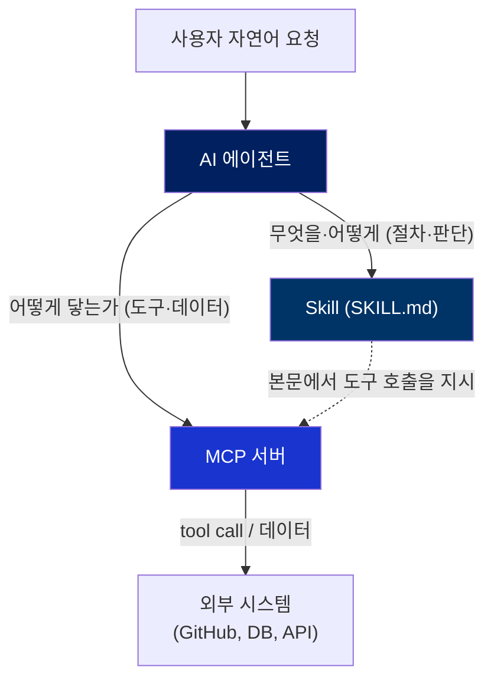
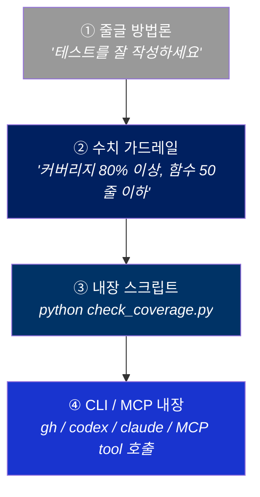
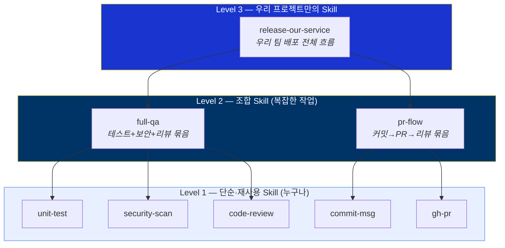

# 스킬은 작고 명시적일수록 강하다 — 재사용 가능한 Skill 설계에 대하여

> AI 코딩 에이전트와 함께 개발하면서 정리하게 된, *어떤 skill이 잘 작동하고 어떤 skill이 안 작동하는가*에 대한 기준을 공유합니다. 이전에 쓴 [Harness Engineering](./claude-harness-ko.md) 글과 [사내 Skills Hub](./samsung-skills-hub-ko.md) 글의 후속 편에 가깝습니다.

AI 에이전트로 개발을 하다 보면, 어느 순간 깨닫게 됩니다. 모델에게 매번 같은 노하우를 복붙하고 있다는 걸요.

"우리 API는 이렇게 인증하고", "커밋 메시지는 이 컨벤션을 따르고", "이 라이브러리는 이렇게 쓰고"… 이런 걸 매 세션마다 다시 설명하는 건 비효율의 끝입니다. 그래서 우리는 이걸 한 번 적어두고 재사용하기 시작했고, 그 형식이 바로 **Skill**입니다.

그런데 막상 skill을 만들어 보면, *잘 작동하는 skill*과 *그냥 있기만 한 skill*의 차이가 꽤 큽니다. 이 글은 그 차이에 대한 이야기입니다.

제 결론을 한 줄로 먼저 말씀드리면 이렇습니다. **하나의 skill은 작고, 한 가지 일만 하고, 극단적으로 명시적이어야 한다. 그리고 그런 작은 skill들을 *조합*해서 복잡한 일을 한다.**

---

## 1. Skill이 뭔가요

본격적인 이야기 전에 짧게 짚고 가겠습니다. *Skill*은 AI 코딩 에이전트 생태계에서 자리잡고 있는 작은 표준입니다.

`SKILL.md`라는 마크다운 파일 한 장에 `name`, `description`, 그리고 본문에는 에이전트가 읽을 수 있는 절차·노하우가 들어갑니다. 대부분의 Agentic 도구(Claude Code / Cursor / Codex / Cline / Gemini CLI 등)가 사용자의 자연어 요청을 보고, 트리거가 맞는 SKILL.md를 *알아서* 자기 컨텍스트에 끌어와 사용합니다.

쉽게 말하면 — 에이전트에게 그때그때 필요한 노하우를 떠먹여주는 *플러그인* 같은 것입니다. 핵심은 **얇다**는 점입니다. 형식이 워낙 단순(`name`, `description`, 본문)하기 때문에, 같은 SKILL.md 한 장이 여러 도구에서 동일하게 동작합니다.

```markdown
---
name: commit-msg
description: Conventional Commits 형식으로 커밋 메시지를 작성한다.
  "커밋", "commit message"를 언급하거나 git commit을 만들 때 사용.
---

# Commit Message

## 형식
<type>: <description>   # type ∈ feat|fix|docs|refactor|test|chore
- 제목 50자 이내, 본문은 72자에서 줄바꿈
- ...
```

이게 전부입니다. 그런데 이 단순함 위에서 설계를 어떻게 하느냐가 결과를 가릅니다.

---

## 2. Skill과 MCP는 경쟁하지 않는다 — 레이어가 다르다

가장 많이 받는 질문이 이겁니다. *"MCP가 있는데 Skill이 왜 필요하죠? 아니면 그 반대로요."*

둘은 경쟁 관계가 아닙니다. **레이어가 다릅니다.**

- **MCP(Model Context Protocol)** 는 에이전트가 *외부 세계와 통신하는 방법*입니다. 도구를 호출하고(tool call), 데이터를 가져오고, 시스템에 접근하는 *배관(plumbing)*이에요. "이 GitHub API를 어떻게 호출하는가", "이 DB에 어떻게 쿼리하는가"를 표준화합니다.
- **Skill** 은 에이전트가 *무엇을 언제 어떻게 해야 하는지에 대한 절차·판단*입니다. "이 작업을 할 때는 먼저 A를 확인하고, B 규약을 따르고, C로 검증하라"는 *방법론(methodology)*이에요.

비유하자면 MCP는 *손과 발*이고, Skill은 *작업 지시서*입니다. 손발이 아무리 좋아도 무엇을 어떤 순서로 할지가 없으면 헛돕니다. 반대로 완벽한 지시서가 있어도 손발이 없으면 실행을 못 하고요.



그래서 **가장 강력한 조합은 Skill이 MCP를 *부리는* 것**입니다. SKILL.md 본문에 "이 단계에서는 이 MCP 도구를 호출하라"고 적어두면, 절차(skill)와 실행(mcp)이 맞물립니다. Skill은 *언제·왜*를 알고, MCP는 *어떻게 닿는가*를 압니다.

참고로 모든 skill이 MCP를 필요로 하진 않습니다. 순수하게 "이런 컨벤션을 따르라"는 지식만 담은 skill도 충분히 유용합니다. MCP는 *외부에 닿아야 할 때* 끌어들이는 것이지, 전제 조건이 아닙니다.

### 잠깐 — "MCP는 죽었다, CLI 만세" 논쟁

2026년 초 *"MCP는 죽었다, CLI 만세"* 라는 글이 화제가 됐고, MCP가 과한 거품 아니냐는 논쟁이 붙었습니다. 제 입장은 단순합니다.

**Web에 도구를 등록해야 하는 경우엔 MCP가 꼭 필요합니다.** 그 자리를 대체할 다른 표준이 아직 없으니까요. **하지만 Local에서 돌릴 거라면, CLI나 API를 잘 wrapping한 skill보다 MCP가 더 번잡스럽기만 합니다.** 떠 있는 서버 프로세스, 스키마 사전 선언, MCP 전용 디버깅… 이미 LLM이 잘 아는 `gh`·`jq`를 skill 본문에서 그냥 호출하는 것보다 나을 게 없습니다. 솔직히 로컬 MCP는 유행 따라 만드는 아이템에 가깝다고 봅니다.

그리고 어느 쪽이든, **정말 중요한 건 그 밑의 API를 잘 설계하는 것**입니다. API가 깔끔하면 CLI로 감싸든 MCP로 감싸든 잘 동작하고, API가 엉망이면 무엇으로 감싸도 엉망입니다. 포장(CLI냐 MCP냐)은 그 다음 문제예요.

---

## 3. Skill을 어떻게 쓰나 — 그리고 찾게 만드나

Skill을 만들었다면, 다음 문제는 *그걸 어떻게 배포하고 발견하게 하는가*입니다.

외부 생태계에는 이미 답이 있습니다. Vercel의 `find-skills`(메타 스킬) + `skills.sh`(허브) + `skills`(CLI) 세 조각이 맞물려서, 에이전트가 *자연어 요청 → 적절한 skill 검색 → 설치 → 사용*까지 알아서 하게 만듭니다.

문제는 이게 *공개 인터넷*에서만 돈다는 거였습니다. 사내 코드는 사내 GitHub에 있지 github.com에 있는 게 아니니까요. 그래서 저는 이 작동 모델을 그대로 사내에 한 벌 옮긴 **Samsung Skills Hub**를 만들었습니다. 외부 `skills.sh` 자리에 사내 Hub, `skills` CLI 자리에 `sec-skills`, `find-skills` 자리에 `samsung-find-skills`가 들어가는 식이에요. (자세한 배경은 [별도 글](./samsung-skills-hub-ko.md)에 풀어뒀습니다.)

여기서 이 글의 주제와 직접 연결되는 포인트가 하나 있습니다. **`find-skills`/`samsung-find-skills` 자체가 "한 가지 일만 하는 명시적인 skill"의 모범 사례**라는 점이에요. 이 메타 스킬은 코드를 한 줄도 짜지 않습니다. 하는 일은 단 하나 — *"검색해서, 후보 보여주고, 승인받아 설치하라"*. 그 단일 책임을 극도로 명시적인 절차로 적어뒀기 때문에, 모든 IDE 에이전트에서 똑같이 동작합니다.

즉, *잘 만든 skill은 발견·재사용·공유가 쉽다*는 게 핵심입니다. 그리고 발견과 재사용이 쉬우려면 — 다음 장의 설계 원칙들이 지켜져야 합니다.

---

## 4. 좋은 Skill은 어떻게 설계하는가

여기가 이 글의 본론입니다. 제가 중요하게 생각하는 설계 원칙을 하나씩 풀어보겠습니다.

### 4.1 한 skill은 한 가지 일만 — 명시성(explicitness)이 전부

가장 중요한 원칙입니다. **하나의 skill은 한 가지 목적만 가져야 합니다.**

"프론트엔드 개발"이라는 skill은 나쁜 skill입니다. 너무 넓어서 에이전트가 *언제* 이걸 써야 할지 모르고, 본문도 결국 두루뭉술해집니다. 반면 "React 컴포넌트에 접근성(a11y) 속성을 점검한다"는 skill은 좋습니다. 트리거가 명확하고, 절차가 구체적이고, 결과가 검증 가능합니다.

명시적일수록 좋은 이유는 단순합니다. 에이전트도 사람과 똑같아서, *모호한 지시*를 받으면 모호하게 일합니다. 한 가지 일만 하는 skill은 그 한 가지를 *정확히* 하도록 강제합니다. (이건 제가 [이전 글](./claude-harness-ko.md)에서 말한 "구조가 명시성을 강제한다"와 같은 이야기입니다.)

### 4.2 SKILL.md는 500줄을 넘기지 않는다

이건 제 개인적인 규칙인데, 꽤 강하게 믿습니다. **SKILL.md 한 장이 500줄을 넘어가면, 그건 십중팔구 두 개 이상의 skill이 뭉쳐 있는 것입니다.**

500줄을 넘기 시작하면 두 가지 문제가 생깁니다. 첫째, 에이전트의 컨텍스트를 너무 많이 잡아먹습니다 — skill 하나 로드했을 뿐인데 컨텍스트 윈도우가 출렁입니다. 둘째, 그렇게 긴 문서는 *한 가지 일*을 하고 있지 않다는 신호입니다. 4.1의 위반이죠.

500줄을 넘으면 저는 자릅니다. 공통 절차는 별도 skill로 빼고, 상세한 레퍼런스는 본문이 아니라 `references/` 같은 하위 파일로 내리고(필요할 때만 읽도록), 본문은 *핵심 절차*만 남깁니다. 숫자가 임의적으로 보일 수 있지만, 임의의 가드레일이라도 *있는 것*이 *없는 것*보다 훨씬 낫습니다. 선이 있어야 넘었다는 걸 알 수 있으니까요.

### 4.3 구조 — name, description, 그리고 workflow

좋은 SKILL.md의 뼈대는 셋입니다.

- **제목/name** — 무엇을 하는지.
- **description** — *이게 제일 중요합니다.* 에이전트가 "지금 이 skill을 써야 하나?"를 판단하는 거의 유일한 근거입니다. description이 부실하면, 아무리 본문이 훌륭해도 *영원히 발동되지 않는* skill이 됩니다. 그래서 description에는 "무엇을 하는가"뿐 아니라 **"언제 쓰는가"(트리거가 되는 상황·키워드)** 를 반드시 넣어야 합니다.
- **workflow/methodology** — 본문. 수행 방법론.

특히 description은 *사람*이 아니라 *에이전트*가 읽고 검색한다는 걸 기억해야 합니다. 사람용 한 줄 요약이 아니라, 에이전트가 자연어 요청과 매칭할 수 있는 *신호*를 담아야 합니다.

### 4.4 줄글 < 수치 가드레일 < 스크립트 < CLI/MCP 내장

workflow를 적을 때, 같은 내용이라도 *형태*에 따라 신뢰도가 다릅니다. 위로 갈수록 약하고, 아래로 갈수록 강합니다.



- **① 줄글** — "좋은 코드를 쓰세요" 같은 건 거의 효과가 없습니다. 에이전트가 해석하기 나름이라 비결정론적입니다.
- **② 수치 가드레일** — "함수는 50줄 이하, 파일은 800줄 이하, 커버리지 80% 이상." 숫자가 들어가면 에이전트도 *판정*할 수 있습니다. 모호함이 사라집니다.
- **③ 내장 스크립트** — 검증을 줄글로 부탁하는 대신, skill 안에 `scripts/check_brand.py` 같은 걸 넣어두고 *실행*하게 합니다. 에이전트의 판단이 아니라 *코드의 판정*이 되므로 결정론적입니다. (제가 만든 사내 문서 skill이 정확히 이렇게 동작합니다 — 브랜드 위반을 스크립트가 잡아냅니다.)
- **④ CLI/MCP 내장** — 가장 강력합니다. `gh`로 PR을 만들고, MCP 도구로 외부 데이터를 가져오고, 심지어 `codex`나 `claude` 같은 *다른 에이전트 CLI*를 호출해서 하위 작업을 시키기도 합니다. skill이 단순한 "지식"을 넘어 *실행 능력*을 갖는 단계입니다.

핵심은 — **에이전트의 자유 해석에 맡기는 부분을 최대한 줄이고, 기계가 판정·실행하는 부분을 최대한 늘려라.** 위에서 아래로 내려갈수록 그렇게 됩니다.

### 4.5 Skill이 Skill을 호출한다 — 3단 계층

이게 제가 가장 강조하고 싶은 부분입니다. **좋은 skill 생태계는 평평하지 않고, 계층적입니다.**



- **Level 1 — 단순하고 직관적인 skill.** 한 가지 일만 하고, 어느 프로젝트에나 가져다 쓸 수 있습니다. `commit-msg`, `unit-test`, `security-scan` 같은 것들이요. **이런 skill은 누구나 재사용·공유가 가능해야 합니다.** 그리고 바로 여기에 *복리*가 있습니다 — 한 사람이 잘 만든 Level 1 skill을 모두가 공유하면, *모두의 기본기가 같이 올라갑니다.* 각자 따로 만들던 걸 한 번 잘 만들어 공유하는 게 조직 전체의 레벨을 올리는 가장 싼 방법입니다.
- **Level 2 — 조합 skill.** Level 1들을 묶어 복잡한 작업을 처리합니다. `full-qa`는 `unit-test`+`security-scan`+`code-review`를 순서대로 부립니다. 자기는 직접 일을 거의 안 하고, *오케스트레이션*만 합니다.
- **Level 3 — 나만의/우리 프로젝트만의 skill.** Level 2들을 묶어 우리 팀의 고유한 흐름을 만듭니다. 우리 서비스의 배포 규약, 우리만의 릴리즈 사이클 같은 것이요. 재사용성은 낮지만, *우리에게는* 가장 강력합니다.

이렇게 분리하면 두 가지가 좋아집니다. 첫째, **각 skill이 작아져서 에이전트가 더 잘 이해하고 더 잘 동작합니다.** 둘째, **재사용 경계가 명확해집니다** — Level 1은 전사 공유, Level 3는 우리 팀 전용. 거대한 단일 skill 하나로는 절대 못 얻는 구조입니다.

> Level 1을 잘 쪼개 공유하는 문화가 자리잡으면, Skills Hub 같은 인덱서의 가치가 폭발합니다. 좋은 1레벨 부품이 많을수록 2·3레벨 조립이 쉬워지니까요.

### 4.6 Skill 안에서 subagent·model·CLI까지 선언한다

요즘 도구들은 skill 안에서 *실행 환경*까지 선언할 수 있게 진화했습니다. 이걸 활용하면 skill이 단순한 문서를 넘어 *작은 실행 단위*가 됩니다.

- **모델 선언** — 이 skill은 가벼우니 Haiku로, 저 skill은 깊은 추론이 필요하니 Opus로. skill별로 적합한 모델을 지정해 비용과 품질을 동시에 잡습니다.
- **subagent 선언** — 해당 skill에서만 쓰는 전용 에이전트를 정의해 넣습니다. 예를 들어 리뷰 skill 안에 "리뷰어 페르소나" 에이전트를 박아두는 식이죠. 생성하는 주체와 평가하는 주체를 분리하는 패턴([이전 글](./claude-harness-ko.md) 참고)을 skill 레벨에서 구현하는 겁니다.
- **CLI 내장** — `gh`는 기본이고, 그 위에 `codex`·`claude` 같은 다른 코딩 에이전트를 *내장 호출*해서 하위 작업을 위임할 수도 있습니다. skill이 또 다른 에이전트를 부리는, 일종의 재귀적 구조입니다.

이쯤 되면 skill은 "노하우를 적은 문서"가 아니라, **모델·에이전트·도구·절차를 한 단위로 묶은 실행 패키지**가 됩니다. 그리고 이게 4.5의 계층 구조와 만나면 — 작고 명시적인 실행 단위들이 레고처럼 조립되는 그림이 완성됩니다.

---

## 5. 정리하며

Skill을 둘러싼 제 생각을 한 문장으로 압축하면 이렇습니다. **작게, 명시적으로, 한 가지만. 그리고 조합하라.**

- 하나의 skill은 한 가지 일만 합니다. 500줄을 넘으면 자릅니다.
- description은 에이전트가 *찾을 수 있도록* 씁니다. 트리거 상황을 명시합니다.
- 줄글보다 수치 가드레일, 그보다 스크립트, 그보다 CLI/MCP 내장이 강합니다. 자유 해석을 줄이고 기계 판정을 늘립니다.
- Level 1(누구나 재사용) → Level 2(조합) → Level 3(우리 전용)으로 계층화합니다. Level 1을 잘 쪼개 공유하면 *조직 전체의 레벨*이 같이 올라갑니다.
- skill 안에 모델·subagent·CLI까지 선언해, 문서가 아니라 *실행 패키지*로 만듭니다.

이게 어렵게 들릴 수 있는데, 사실 방향은 단순합니다. *소프트웨어 엔지니어링에서 좋은 함수를 짜는 원칙*과 똑같아요 — 작게, 단일 책임으로, 잘 이름 짓고, 조합 가능하게. Skill은 결국 **에이전트를 위한 함수**입니다. 우리가 사람을 위해 코드를 모듈화했듯, 이제 에이전트를 위해 노하우를 모듈화하는 거죠.

그리고 그 모듈들이 한 곳에 모여 검색·공유되기 시작하면(Skills Hub처럼), 개인의 노하우가 조직의 자산이 됩니다. 저는 그 전환이 이미 시작됐다고 봅니다.

긴 글 읽어주셔서 감사합니다. 작은 skill 하나부터 명시적으로 만들어 보시길 권합니다 — 그게 가장 빠른 첫걸음입니다.

---

### References

- [Anthropic — `anthropics/skills`](https://github.com/anthropics/skills) — SKILL.md 표준과 작동 방식의 원형
- [Anthropic — Claude Code Skills 문서](https://docs.anthropic.com/) — `SKILL.md` 포맷·subagent·model 선언
- [Anthropic — Model Context Protocol](https://modelcontextprotocol.io/) — MCP 표준
- [ejholmes — "MCP is dead, long live the CLI"](https://ejholmes.github.io/2026/02/28/mcp-is-dead-long-live-the-cli.html) — CLI 진영 원글 ([GeekNews 논의](https://news.hada.io/topic?id=27129))
- [chrlschn — MCP를 옹호하는 반론](https://news.hada.io/topic?id=27530) — 원격 MCP·조직 차원 인증/관찰가능성 관점
- Vercel — `find-skills` / [`skills.sh`](https://skills.sh) / `skills` CLI — 공개 인터넷 측 스킬 생태계

---

원문 작성: Junu Jeon · MIT License.
